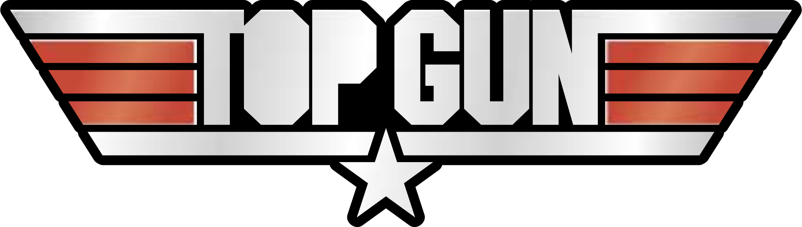
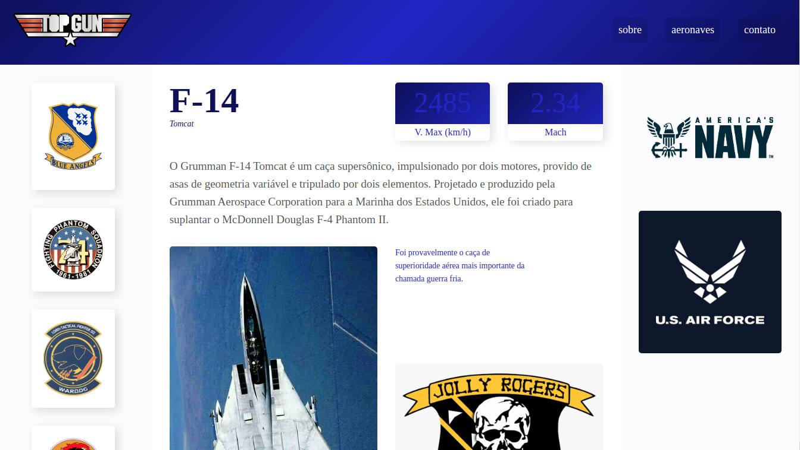
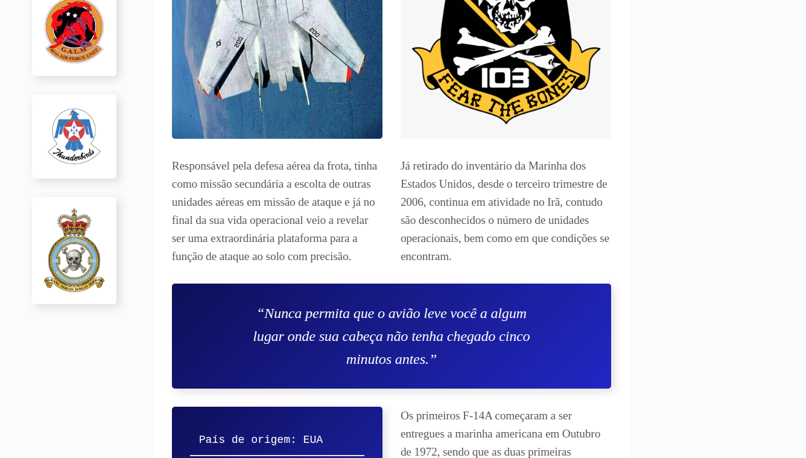
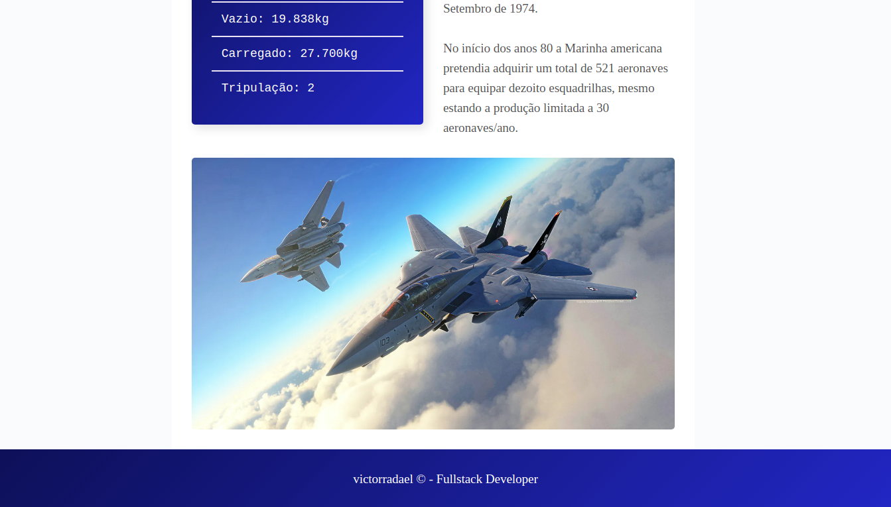

<div align="center">



# Aviation Curiosities


</div>

## Table of Contents

- [About](#about)
- [Getting Started](#getting_started)

## About <a name = "about"></a>

Using only HTML and CSS, during the training given by [Origami](https://www.origamid.com/), I developed this layout inspired by the film Top Gun to talk about military aircraft, which in this case is the F - 14 aircraft used by the United States Navy.

## Getting Started <a name = "getting_started"></a>

To make yours, just clone the repository

```sh
git clone https://github.com/victorradael/TopGunAviationCuriosities.git
```

### See how it looks





<div align="center">

### developed by: [victorradael](https://github.com/victorradael)

</div>
